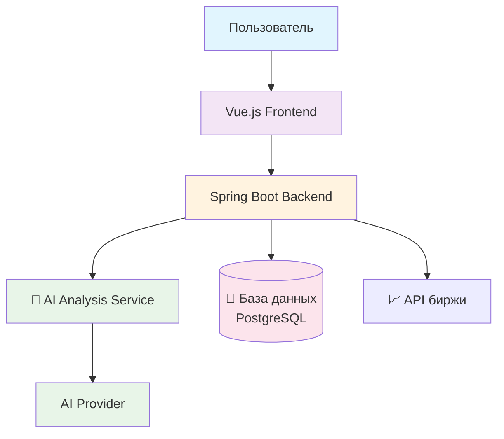

# BP Invest 📈

[](https://vuejs.org/)
[](https://spring.io/projects/spring-boot)
[](https://docker.com)
[](https://postgresql.org)

**BP Invest** — это современное веб-приложение для комплексного анализа акций. Приложение предоставляет инвесторам инструментарий для принятия инвестиционных решений на основе актуальных финансовых данных и AI-аналитики.

---

## ✨ Возможности

### 📊 Фронтенд (Vue.js)
- **Комплексный анализ мультипликаторов:** P/E, P/S, EPS и другие ключевые показатели
- **Интерактивные графики цен:** Динамика цен с выбором временных интервалов
- **AI-анализ акций:** Аналитика и прогнозы на основе искусственного интеллекта
- **Адаптивный интерфейс:** Оптимизирован для разных устройств

### 🔧 Бэкенд (Spring Boot)
- **REST API:** Документированное API для работы с данными
- **База данных:** Хранение пользовательских данных
- **Безопасность:** JWT, OAuth 2 аутентификация и авторизация

### 🛠️ Технологический стек
#### Frontend (Vue.js Ecosystem)
- Фреймворк: Vue 3
- Сборка: Vite
- Роутинг: Vue Router 4 с lazy loading
- Графики: Chart.js

#### Backend (Spring Boot Ecosystem)
- Фреймворк: Spring Boot 3.x + Java 17+
- Безопасность: Spring Security 6 + JWT + OAuth 2.0
- База данных: PostgreSQL + Hibernate/JPA
- Документация: OpenAPI 3 + Swagger UI
- Миграции: Liquibase
- Тестирование: JUnit 5 + Mockito + JaCoCo

#### Инфраструктура
- Контейнеризация: Docker + Docker Compose
- База данных: PostgreSQL 14+

---

## 🖼️ Пользователский интерфейс

| Страница анализа мультипликаторов | Интерактивный график цен |
| :---: | :---: |
|  |  |

| AI-анализ акций | Страница аутентификации |
| :---: | :---: |
|  |  |

---

## 🏗️ Архитектура проекта



## 🚀 Быстрый старт
### Предварительные требования
- Docker 28.3.2+
- Docker Compose 2.38.2+
- Сборка: Maven
- Code Quality: Lombok

### Запуск приложения
Клонируйте репозиторий:

```bash
git clone https://github.com/your-username/bp-invest.git
cd bp-invest
```

Отредактируйте application.properties файл, указав ваши API-ключи
Запустите все сервисы:

```bash
docker-compose up --build
```
